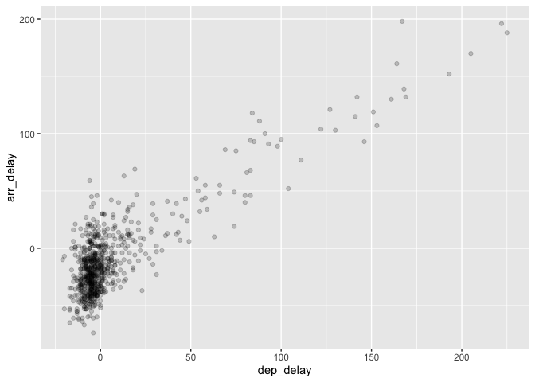
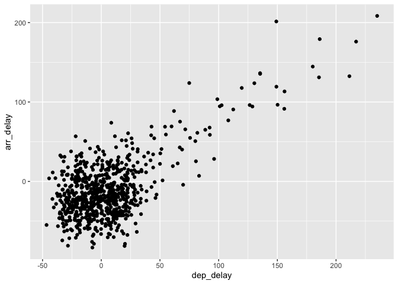

alaska_flights
================

## Fixing overplotting in alaska_fligths

There are two ways to fix overplotting. First way of addressing
overplotting is to change the **transparency/opacity** of the points by
setting the alpha argument in geom_point(). We can change the alpha
argument to be any value between 0 and 1, where 0 sets the points to be
100% transparent and 1 sets the points to be 100% opaque. By default,
alpha is set to 1. In other words, if we don’t explicitly set an alpha
value, R will use alpha = 1. The second way is **jittering the points.**
This means giving each point a small “nudge” in a random direction. You
can think of “jittering” as shaking the points around a bit on the plot.

## Packages

*load the packages that will be used*

``` r
library(tidyverse)
library(nycflights13)
```

## Create alaska_flights variable

*We use filter to select only the alaska flights from the package*

``` r
alaska_flights <- flights %>% 
  filter(carrier == "AS")
```

## Transparency example

*You can set alpha to any value between 0-1.*

``` r
ggplot(data = alaska_flights, mapping = aes(x = dep_delay, y = arr_delay)) + 
  geom_point(alpha = 0.2)
```

    ## Warning: Removed 5 rows containing missing values (geom_point).

<!-- -->

## Jittering example

*To create a jittered scatterplot, instead of using geom_point(), we use
geom_jitter().*

``` r
ggplot(data = alaska_flights, mapping = aes(x = dep_delay, y = arr_delay)) + 
  geom_jitter(width = 30, height = 30)
```

    ## Warning: Removed 5 rows containing missing values (geom_point).

<!-- -->
